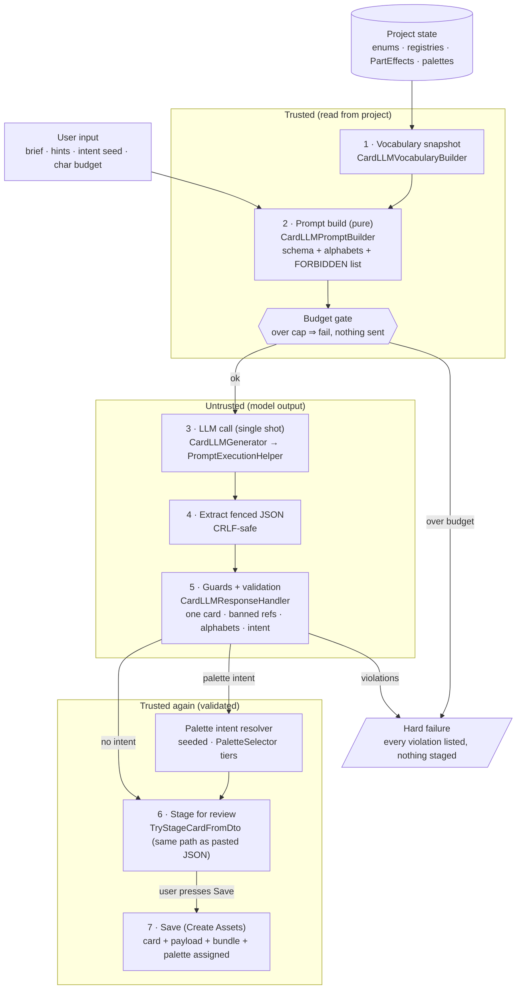

# Report — LLM-Assisted Card Generation Pipeline (CE-L1)

> ALWTTT-facing report, 2026-06-11. Describes how the "Generate with LLM" panel
> in `CardEditorWindow` works end to end. Pattern authority:
> MidiGenPlay `authoring/SSoT_Authoring_LLM_Generation.md` (§7, third adopter).
> Asset semantics: `SSoT_CompositionCards_TrackStyleBundles.md` §5.3.
> This report is explanatory reference material, not an SSoT.

## The one-sentence model

**The LLM knows nothing about the project. Every fact it appears to "know" is
read from the project moments before the call and written into the prompt — and
everything it sends back is distrusted until proven valid.**

## Infographic



## The seven stages in detail

### 1. Vocabulary snapshot — how the LLM "knows" your enums and palettes

`CardLLMVocabularyBuilder.Build(registries)` runs at the moment Generate is
clicked. It is the ONLY place the pipeline touches ALWTTT game types:

- **Enum alphabets** via `Enum.GetNames()` on the compiled types
  (`CardPerformerRule`, `MusicianCharacterType`, `CardType`, `RarityType`,
  `AudioActionType`, `SpecialKeywords`, `ActionTargetType`, `CardActionTiming`,
  `TrackRole`, `CardPrimaryKind`, `PartActionKind`, `CardAcquisitionFlags`,
  `TimeSignature`). Nothing is hand-maintained; add an enum member and the next
  generation offers it.
- **Status keys** enumerated from BOTH catalogues on
  `ALWTTTProjectRegistriesSO` (musicians + audience) — exactly the set the
  staging path's `TryGetStatusEffectByKey` can resolve. Falls back to a
  `StatusEffectSO` asset scan when registries are unwired (an unregistered key
  then fails loudly at staging; never silently wrong).
- **Modifier effect names** from a `t:PartEffect` asset scan — the only
  identifiers the LLM may use for modifiers.
- **Palettes** from `CardPaletteDescriptorScanner`: every
  `DrumPatternPaletteSO` and `ChordProgressionPaletteSO`, each with display
  name, notes, and per-entry meter/measure/onset features (the same numbers the
  CE-F1 finders feed the selector).

Design decision D-CE-L1.4: this is a **live snapshot string-POCO**, not a
hand-authored vocabulary asset like the drum/chord adopters use — because for
cards the alphabet *is* the project state.

### 2. Prompt build — pure, budget-gated

`CardLLMPromptBuilder` welds the snapshot into a **system prompt**: the output
contract (EXACTLY ONE card, one fenced ```json block), the full schema with
every allowed value spelled out per field, the effect types with the
status-key list, palette-intent instructions with the available palettes per
role and their meters, and an explicit FORBIDDEN list (`cardSpritePath`,
`trackAction.styleBundle`, `modifierEffects` paths, `statusActions`,
`action.actions/conditions`). The **user prompt** is the brief plus hints.
Total characters are checked against the budget **before** anything is sent —
an over-budget prompt fails with zero tokens spent.

> **Discriminator drift — recorded 2026-08-26 (DOC-APPLY-3, from DD-R5d-20).** The prose above
> said "four effect types"; the code has enumerated **six** since R4
> (`ApplyStatusEffect`, `DrawCards`, `ModifyVibe`, `ModifyStress`, `AddInspirationPerLoop`,
> `RevealPreferences` — `CardLLMPromptBuilder`, one `AppendLine` each). The count is corrected
> above.
>
> **The list is hand-maintained, and it is now behind the import schema.** R5-d added a seventh
> discriminator, **`GrantBonusLoop`**, to `CardJsonImport`
> (`SSoT_Card_Authoring_Contracts.md` §5.6c). It is **not** in the prompt builder, so the
> generator cannot emit it. This is a **code** gap, not a documentation one, and it is the
> generic failure mode of this stage: unlike the enum alphabets of stage 1 — which come from
> `Enum.GetNames()` and self-update — the effect-type block is typed out by hand and silently
> ages. Candidate fix: derive it from the `CardEffectSpec` subclass set the importer accepts.
> No batch assigned.

### 3–4. The call and extraction

One single-shot request through LLM Core's `PromptExecutionHelper` (async,
never blocks the editor thread; the same seam `FakeLLMClient` exercises in
tests). A CRLF-safe extractor pulls the fenced JSON object out of whatever
prose surrounds it (fenced block → bare object → outermost-braces slice; the
parser fails loudly if the slice isn't valid JSON).

### 5. Guards — distrust everything

The model knowing the alphabets is a courtesy, not the safety mechanism.
`CardLLMResponseHandler` performs the single shared DTO parse (Generate and
Import-from-clipboard converge here) and then:

- **Exactly one card** — batch payloads fail.
- **Banned-asset-reference guard**: any non-empty `cardSpritePath`,
  `trackAction.styleBundle`, or `modifierEffects` entry — and any
  path/guid-shaped string smuggled into `modifierEffectNames` — is a hard
  failure. Rationale: the underlying staging path loads these via
  `LoadAssetByPathOrGuid` and silently skips unresolvable ones; tolerable for
  hand-authored JSON, unacceptable for generated content, so the guard moves up.
- **Out-of-alphabet guard**: every emitted token is re-checked against the
  vocabulary (case-insensitively). `"rarity": "Mythic"` or an unknown status
  key fails the whole generation, with EVERY violation listed at once.
  Rationale: staging's `SetEnumByName` warns-and-keeps-default — a silent
  fallback the LLM route must not inherit (the same D-L4.5 doctrine as the
  chord adopter). Omitted fields legitimately take defaults; omission is not a
  wrong token.
- **Palette intent resolution**: the model never names a palette. It emits
  intent — `composition.palette: { requested, timeSignature?, keywords? }` —
  and `CardPaletteIntentResolver` resolves it over the real palettes through
  the shared CE-F1 `PaletteSelector` (exact-meter tier → heuristic tier → raw
  weights), seeded with the panel's **intent seed**. Same payload + same seed ⇒
  same pick, reproducibly. Rhythm role → drum palettes; Backing role → chord
  palettes; Melody/Harmony intent fails loudly (no palette types exist).
  Unmatched keywords fail listing the available palettes. The `requested` flag
  exists because Unity's JsonUtility default-constructs absent nested objects —
  an empty palette object is NOT an intent.

### 6. Staging — same path as a human

The validated DTO goes through the window's existing `TryStageCardFromDto` —
bit-for-bit the path a hand-pasted JSON takes. Two things resolve here:
`modifierEffectNames` → `PartEffect` assets (exact case-insensitive name,
all-or-nothing: missing fails listing available, ambiguous fails listing
colliders) and the card sprite (the staging path's musician default — never
LLM-chosen). Nothing touches disk.

### 7. Save — assets, bundle, palette

Only when the user presses the existing **Save (Create Assets)** does anything
persist: card + payload assets, catalog entry, then the LLM hook
(`ApplyLlmPlanOnSave`) creates the role bundle via the existing
`CreateAndAssignStyleBundle` and assigns the resolved palette to
`patternPalette` / `progressionPalette`. Every can't-apply branch logs loudly.
Discarding the staged card clears the pending plan.

## Reproducing the exact prompt

The prompt is fully deterministic given (vocabulary snapshot, panel inputs).
There is currently no UI affordance to view it; to reproduce, call
`CardLLMPromptBuilder.Build(CardLLMVocabularyBuilder.Build(registries), input)`
in an editor script, or add a temporary `Debug.Log(build.SystemPrompt)` in
`GenerateCardAsync`. A "Copy prompt" button across all three LLM panels is a
noted future-work item.

## Smoke baseline (2026-06-11)

Brief *"Generate a simple composition card with Flow effect"*, auto hints,
seed 12345, budget 8000 → card `cmp_flow_rhythm` ("In The Flow"): Rhythm role,
ApplyStatus Flow +2 Self, `TempoEffect_Moderate` modifier, palette
'Syncopated Pocket (4/4)', StarterDeck+UnlockedByDefault ×2.
**1572 input / 366 output tokens.**

## File map (ALWTTT project)

| File | Role |
|---|---|
| `Assets/Scripts/Cards/LLMAuthoring/ALWTTT.Cards.LLMAuthoring.asmdef` | Editor-only core assembly (refs MidiGenPlay.Runtime, BCS.LLM.Core.Runtime) |
| `…/CardImportDtos.cs` | Shared DTO schema (incl. `PaletteIntentJson.requested`) |
| `…/CardImportDtoParser.cs` | Shared parse (JSON box + LLM routes) |
| `…/CardLLMVocabulary.cs` | Snapshot POCO + palette descriptors |
| `…/CardPaletteDescriptorScanner.cs` | Palette asset scans + `LoadPalette<T>` |
| `…/CardPaletteIntentResolver.cs` | Intent → deterministic seeded pick |
| `…/CardLLMPromptBuilder.cs` | Stage 2 (pure, budget-gated) |
| `…/CardLLMGenerator.cs` | Stage 3–4 (call + extraction) |
| `…/CardLLMResponseHandler.cs` | Stage 5 (parse + guards + resolution) |
| `…/CardLLMFieldPlan.cs` | Stage 6 decision (pure) |
| `…/AssemblyInfo.cs` | InternalsVisibleTo the test assembly |
| `…/Tests/` (asmdef + 6 fixtures + FakeLLMClient) | 77 tests, no live calls |
| `Assets/Scripts/Cards/Editor/LLM/CardLLMVocabularyBuilder.cs` | Stage 1 (the only game-type toucher) |
| `Assets/Scripts/Cards/Editor/CardEditorWindow.LLM.cs` | Stage 7 panel + Save hook |
| `Assets/Scripts/Cards/Editor/CardEditorWindow.JsonImport.cs` | Staging path (+ name resolution, Save/discard hooks) |
